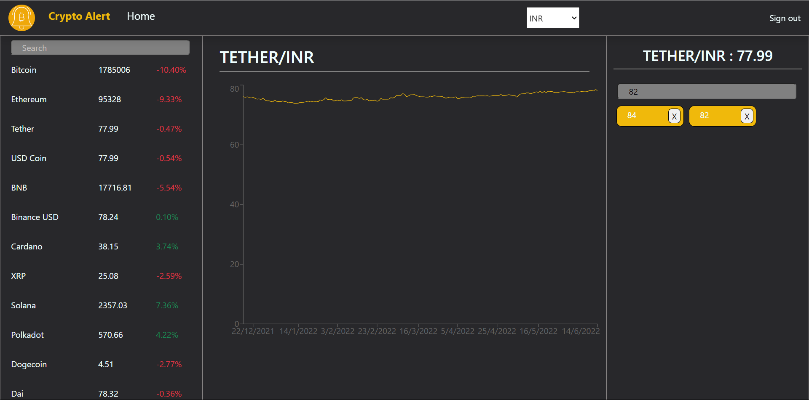

# Crypto Alert

### This project allows the user to view various cryptocurrencies with their respected charts.

### .Users can access around 100 cryptocurrencies in two different currencies USD and INR.

### .With both the currencies and all options in crypto, users can view their charts for daily interval data.

### .Users can also put multiple target values for different charts such that if the current price ever reaches the target price the site will send an email to the user for that price of the cryptocurrencies.

### .User can add many targets as he likes for the cryptos and remove them as per their need

### .A sample of the mail is shown below

**Note: The email functionality is currently disabled by commenting out the email code in emailing.js In case a user needs that function kindly download and edit that part and put their emailjs API key to see the proper functioning of the project** 

Thanks
